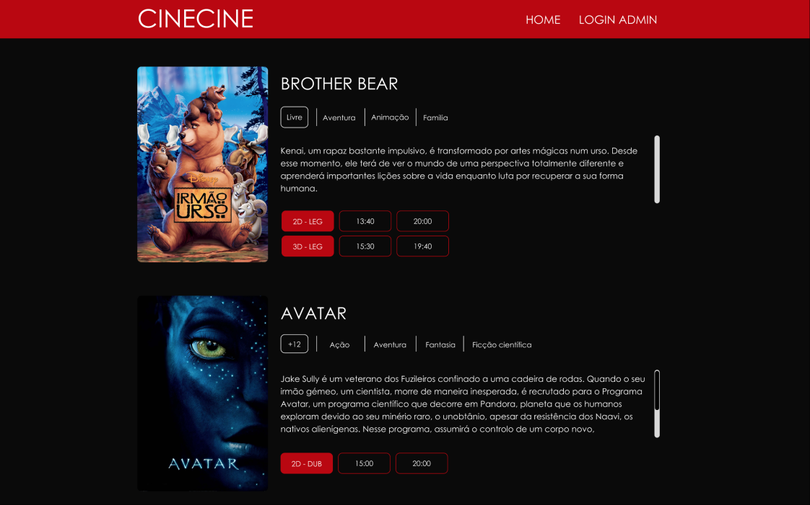
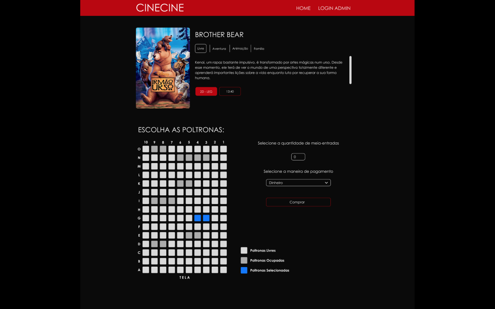
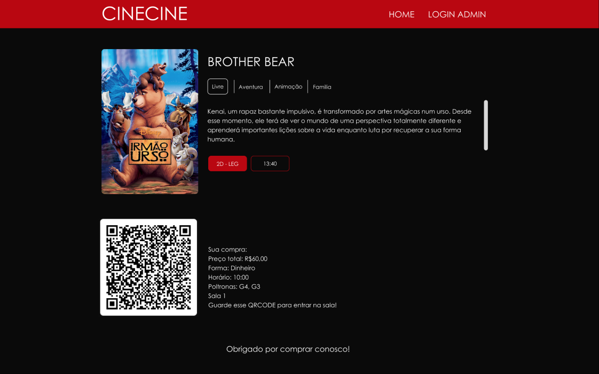

# CINECINE
Final Project for Object Oriented Programming 2

## Images

## How to run
> - Download the project and open it in your favorite IDE.
> - Import all the project dependencies by using this command: `pip install -r requirements.txt`
> - Run the project by using this command: `python run.py`
> - Use the link provided by the IDE to access the application.
> - If you wish to reset the database, run this command: `python reset_storage.py`

## How to use
> - The application is divided in two parts: the admin and the user.
> - The admin is responsible for creating and managing the movietheater.
> - The user is responsible for buying tickets and watching movies.
>
> ### Admin
> - The admin can create, update and delete sessions.
> - But he needs to login first.
> - The 'ultra secret' password is 'adminadmin'.
> - After logging in, the admin can see all the movietheater profits.
> - He can also see all the sessions, create, edit and delete (change the movie name to '-') them.
> >#### Creating a session
> > >- To create a session, click on the 'Adicionar nova sessão' button.
> > >- Fill the form with the session information.
> > >- If you want to see how the session will look like, click on the 'aplicar' button.
> > >- If you want to save the session, click on the 'confirmar' button.
> > >- If you want to cancel the session creation, click on the 'cancelar' button.
> >#### Editing a session
> > >- To edit a session, click on the session you want to edit.
> > >- Fill the form with the new session information.
> > >- If you want to see how the session will look like, click on the 'aplicar' button.
> > >- If you want to save the session, click on the 'confirmar' button.
> > >- If you want to cancel the session edition, click on the 'cancelar' button.
> >#### Deleting a session
> > >- To delete a session, click on the session you want to delete.
> > >- Change its movie name to '-'.
> > >- Click on the 'confirmar' button.
> ### User
> - The user can buy tickets to watch movies.
> >#### Buying a ticket
> > >- To buy a ticket, click on the session you want to watch.
> > >- Select your seats.
> > >- Write the number of half-price tickets you want to buy.
> > >- Select the payment method.
> > >- Click on the 'comprar' button.
> > >- You will be redirected to a page containing all the information of your purchase and a QR code.
> > >- Save the QR code to show it at the movietheater entrance.
> > >- Enjoy the movie.

## Poo Concepts used:
> - Inheritance (Sessao inherits from Filme)
> - Polymorphism (Sessao also has a method called __post_init__())
> - Agrregation (Sala has a list of Sessoes)

## Poo Patterns we would use:
> - Factory (Sala, Filme, Sessao)
> - We would use the Factory pattern to create the objects in a more organized, efficient and easy way.
